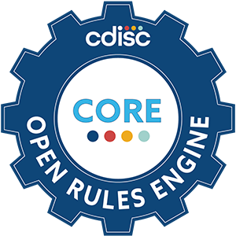

# CDISC Rules Engine (CORE)

  

CORE is the open-source offering of the CDISC Conformance Rules Engine — a tool for validating clinical trial data against CDISC data standards.

---

## Scope

CORE validates study datasets against published CDISC conformance rules for the following standards:

| Standard | Description |
|---|---|
| **SDTMIG** | Study Data Tabulation Model Implementation Guide |
| **SENDIG** | Standard for Exchange of Nonclinical Data |
| **ADaM** | Analysis Data Model |
| **TIG** | Therapeutic Area Implementation Guide |
| **FDA Business Rules** | FDA submission conformance rules |
| **USDM** | Unified Study Definitions Model |

CORE validates data *structure and conformance* against published rules. It is not a replacement for clinical review, statistical analysis, or submission readiness assessment. Rule logic is defined in [`cdisc-open-rules`](https://github.com/cdisc-org/cdisc-open-rules).

---

## Getting Started

| I want to… | Go to… |
|---|---|
| Run CORE without installing Python | [Quick Start → Executable](quick-start.md#option-1-pre-built-executable) |
| Run from source / contribute code | [Quick Start → From Source](quick-start.md#option-2-from-source-code) |
| See all CLI options | [CLI Reference](cli-reference.md) |
| Integrate CORE into my Python project | [Development → PyPI](development.md#pypi-integration) |
| Build or test CORE | [Development](development.md) |
| Contribute rules or code | [Contributing](contributing.md) |
| Get help or ask a question | [FAQ & Troubleshooting](faq.md) |

---

## Community & Support

- **Questions & Discussions:** [GitHub Discussions — Q&A](https://github.com/cdisc-org/cdisc-rules-engine/discussions/categories/q-a)
- **Bug Reports & Feature Requests:** [GitHub Issues](https://github.com/cdisc-org/cdisc-rules-engine/issues)
- **Rule Contributions:** [cdisc-open-rules](https://github.com/cdisc-org/cdisc-open-rules)
- **CDISC Library API:** [wiki.cdisc.org — Getting Started](https://wiki.cdisc.org/display/LIBSUPRT/Getting+Started%3A+Access+to+CDISC+Library+API+using+API+Key+Authentication)
- **Published CDISC Conformance Rules Github**[cdisc-open-rules](https://github.com/cdisc-org/cdisc-open-rules)
